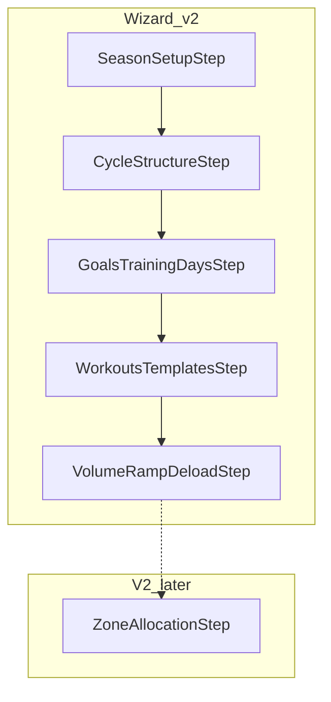

# Plan wizard UI — implementation plan (v2)

> **⚠️ SUPERSEDED (July 2026).** This document plans a **5-step plan wizard** that was never shipped. Production season planning is the single-page **Simple Planner** (`src/components/simple-planner/*`), and the anchor / phase-layout concepts here were dropped. Retained for history only. See [plan-wizard-weekly-template-strategy.md](./plan-wizard-weekly-template-strategy.md) for the current direction (phase-aware weekly templates).

Execute after wireframe + screen spec approval. **Do not** edit `.cursor/plans/` mockup file.

**References:**

- [plan-wizard-pain-points.md](./plan-wizard-pain-points.md) — v2 flow rationale
- [plan-wizard-screen-spec.md](./plan-wizard-screen-spec.md) — v2 step definitions
- [plan-wizard-wireframe.canvas.tsx](file:///C:/Users/pjohn/.cursor/projects/c-Users-pjohn-TiZ/canvases/plan-wizard-wireframe.canvas.tsx)

---

## v2 summary

| Step | Component | Replaces |
|------|-----------|----------|
| 0 | `SeasonSetupStep` | step 0 |
| 1 | `CycleStructureStep` | step 1 (master–detail) |
| 2 | `GoalsTrainingDaysStep` | old 3 + session counts from old 5 |
| 3 | `WorkoutsTemplatesStep` | anchors from old 5 + template link |
| 4 | `VolumeRampDeloadStep` | old 2 + old 4 |

**V2 later:** `ZoneAllocationStep` — new schema/UI for per-discipline zone minutes.



---

## PR breakdown (recommended)

| PR | Scope |
|----|--------|
| **PR 1** | Remap `SETUP_STEPS`, `SETTINGS_SECTIONS`, `saveStep` indices; extract step components (behavior unchanged, new order) |
| **PR 2** | Step 1 master–detail cycle UI |
| **PR 3** | Step 2 goals + training days table |
| **PR 4** | Step 3: anchors + scope toggle; template **link-only** (P0) |
| **PR 5** | Step 4: volume + deload layout (hours only; P1 adds discipline/distance) |
| **PR 7** | P1: per-discipline hours + distance volume + pace/speed rollup |
| **PR 8** | P1+: weekly template preview / season layout (after strategy doc) |
| **PR 6** | Remove `maxRampPercent` from save; settings URL redirects for old `deload`/`focus` slugs |

---

## PR 1 — Step remap + extract (foundation)

### `season-settings-types.ts`

```typescript
export const SETUP_STEPS = [
  "Season setup",
  "Cycle structure",
  "Goals & training days",
  "Workouts & templates",
  "Volume, ramp & de-load",
] as const;
```

### `use-season-settings.ts` — `saveStep` remap

| Step | patchSeason payload |
|------|---------------------|
| 0 | step 0 (unchanged) |
| 1 | mesocycleLengthWeeks, phases (structure) |
| 2 | phases (focus + swim/bike/run sessions) |
| 3 | anchors via existing API (no season patch unless needed) |
| 4 | volume + deload + long flags + phases volume fields + setupComplete |

### Files

- Create `src/components/season/steps/*.tsx` (5 files)
- Slim `season-settings-panels.tsx` to switch on step
- Update `season-setup-wizard.tsx` step count
- Update `season-plan-sidebar.tsx` / settings routes for new slugs

**Tests:** All existing season lib tests pass; add routing test for slug → step.

---

## PR 2 — Cycle structure (step 1)

Unchanged from v1 plan: `CycleStructurePreview` + phase list + detail pane.

---

## PR 3 — Goals & training days (step 2)

**New:** `goals-training-days-step.tsx`

- Merge UI from old step 3 (`focus`) + old step 5 (session count grid)
- Single table per phase
- Reuse `updatePhase`, `updateDisciplineFocus`, `disciplineFocusesForPhase`

**Remove** from wizard: standalone “Goals & focus” and “Workouts / week” steps.

---

## PR 4 — Workouts & templates (step 3)

**New:** `workouts-templates-step.tsx`

| Feature | P0 | P1+ |
|---------|----|-----|
| Scope toggle season / phase | Yes | — |
| `AnchorEditor` per scope | Yes | — |
| Link “Edit weekly template” → `/calendar/template` | Yes | — |
| Explain anchors vs template (copy) | Yes | — |
| Read-only template preview | — | Optional |
| Import preset → phase layout | — | P1 |
| Season phase layout editor | — | P2 |
| Calendar unscheduled workouts | — | V2a |
| Calendar workout pool + library | — | V2b |
| Intensity day flags + default TiZ | — | V2c |
| TiZ assign in pool flow | — | V2d |

**Requires:** `seasonId` before step 3 — ensure step 0–1 save creates plan (already does on patch).

---

## PR 5 — Volume, ramp & de-load (step 4)

**New:** `volume-ramp-deload-step.tsx`

Sections (collapsibles):

1. Season volume defaults (**hours only** in P0)
2. Phase volume table (`resolvePhaseTargets`)
3. Long week chart
4. De-load chart + rules (from old step 2)

**Finish wizard** on step 4 with `setupComplete: true`.

---

## PR 7 — Step 4 P1: discipline volume & distance

| Item | Status | Work |
|------|--------|------|
| Season + mesocycle split % | **Shipped** | `SeasonPlan` + `SeasonMesocycle` split fields; hierarchy meso → season → phase default |
| Per-sport hour ramps | **Shipped** | Phase-level swim/bike/run start/end/ramp %; total = sum when any set |
| Planning mode setting | **Later** | Season setting: overall volume vs per-discipline UI (onboarding + season setup) |
| Distance unit | P1 follow-up | km/mi per discipline on ramp fields |
| Pace / speed | P1 follow-up | Reference fields; convert distance → hours |
| Per-sport de-load | Deferred | — |

---

## PR 6 — Cleanup

- Drop `maxRampPercent` from step 4 save and settings UI state if unused
- Redirect `/plan/settings/deload` → `volume#deload`, `/plan/settings/focus` → `goals`
- Update `DEPLOY.md` only if settings URLs documented

---

## V2 — Zone allocation (separate epic)

| Item | Work |
|------|------|
| Schema | Optional `zoneMinutesByDiscipline` on `SeasonPhase` or `SeasonWeek` |
| UI | Step 5 or settings section; grid phase × discipline × zones |
| Engine | Replace or override `computeZoneMinutesForWeek` when custom zones set |
| Migration | Manual SQL + backfill from focus presets |

**Out of scope** for PRs 1–6.

---

## Verification

1. `npm test` / `npm run build`
2. Full wizard 0→4 save on fresh season
3. Settings sections match wizard layouts
4. Anchors created on step 3 persist and respect phase scope
5. De-load flags + volume curve unchanged numerically (regression)

---

## Decisions (confirmed)

| Item | Decision |
|------|----------|
| Per-discipline hours (step 4) | **P1** |
| Distance-based volume (step 4) | **P1** — reference pace/speed rolls distance → weekly duration |
| Zone allocation | **V2** |
| Weekly template / layout | **Option 2:** season-owned phase layout; athlete template = import preset; **no** layout vs step 2 validation; **V2** unscheduled workouts on calendar |
