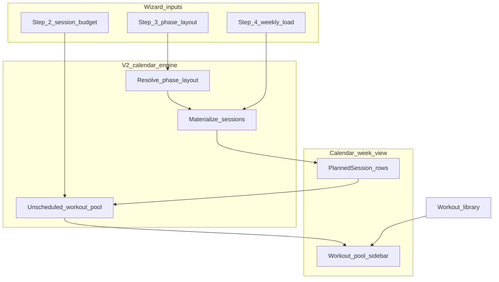

# Weekly template vs anchors — strategy (step 3)

**Status:** Layout strategy unchanged (option 2). **Planner unification finalized** — anchors live in `/plan`; see [season-planner-unified-plan.md](./season-planner-unified-plan.md). Pool spec: [calendar-workout-pool-v2.md](./calendar-workout-pool-v2.md).

**Option 2 confirmed** — season plan owns week layout per phase. Gaps → unscheduled workouts on calendar (**shipped**).

**Related:** [plan-wizard-screen-spec.md](./plan-wizard-screen-spec.md) step 3 · [plan-wizard-implementation-plan.md](./plan-wizard-implementation-plan.md) PR 4

---

## Decision summary (confirmed)

| Topic | Choice |
|-------|--------|
| Layout owner | **Season plan / `SeasonPhase`** — per-phase week grid (option 2) |
| Athlete `WeeklyScheduleTemplate` | **Import preset only** when building season layout; not the runtime source of truth |
| Step 2 session counts | **Weekly budget / target** — informs `SeasonWeek` recompute, **not** a constraint on step 3 layout |
| Layout vs budget gap | **No wizard validation** — in **V2 calendar**, show **unscheduled workouts** for the week |
| Wizard step 3 P0 | Anchors + scope toggle + link to calendar template editor |

---

## What exists today

Three layers that barely talk to each other:

| Layer | Model / code | Scope | Drives calendar? |
|-------|----------------|-------|------------------|
| **Season targets** | `SeasonWeek` via `recomputeSeasonWeeks` | Per season week | No — stored targets only (hours, session counts, zone minutes, long mins) |
| **Anchor workouts** | `AnchorWorkout` · `materializeAnchorsForWeek` | Season or phase; effective date range | Yes — `PlannedSession` with `source: ANCHORED_INSTANCE` |
| **Weekly template** | `WeeklyScheduleTemplate` · `applyWeeklyTemplate` | One per **athlete** (not per season) | Yes — on demand, per week — `source: TEMPLATE` |

**Step 2 (v2)** sets the **weekly session budget** per discipline per phase (`swimSessionsPerWeek`, etc.) — stored on `SeasonWeek` after recompute.  
**Step 3 (v2)** defines **what is actually on the calendar grid** (anchors + phase layout slots) — independent of whether it matches the budget.  
**Step 4 (v2)** sets *how much* load per week (hours, ramp, de-load).  

When V2 materializes sessions from layout, the calendar compares **scheduled** sessions vs **budget** and surfaces the difference as unscheduled workouts (see below).

---

## What step 3 should drive (north star)



### 1. Week layout (primary job — season-owned)

Each `SeasonPhase` has a **week layout**: weekday × discipline slots (plus anchors for named key sessions).

- Defines *which* sessions exist on the grid when materialized
- **Does not** need to match step 2 session counts — athlete may schedule 2 swims when budget is 3
- Optional later: rest-day hints, brick pairing (not P0)

**Anchors** = fixed, named, recurring rows (long run Saturday).  
**Layout slots** = generic placeholders (“Bike endurance”, “Easy run”) on specific weekdays. Each slot may carry a **session role** — especially **`intensity`** (Zone 3+ day) — visible on the calendar when materialized. See [calendar-workout-pool-v2.md](./calendar-workout-pool-v2.md).

Athlete global `WeeklyScheduleTemplate` → **“Import preset”** copies into a phase layout when starting step 3; edits live on the season thereafter.

### 2. Calendar materialization (V2)

On season finish or per-week refresh:

1. Resolve **phase layout** for the week (from `SeasonPhase`)
2. Materialize **anchors** first (`ANCHORED_INSTANCE`)
3. Materialize **layout slots** → `PlannedSession` (new source or extend `TEMPLATE` linkage to season layout items)
4. Attach duration / distance / zone targets from `SeasonWeek` + per-slot overrides

### 3. Unscheduled workouts (V2 calendar — not wizard validation)

Step 2 budgets and step 3 layout are **intentionally decoupled**. The calendar closes the loop:

| Concept | Source |
|---------|--------|
| **Budget** | `SeasonWeek.swimSessions` / `bikeSessions` / `runSessions` (from step 2 + de-load scaling) |
| **Scheduled** | Count of `PlannedSession` per discipline in that calendar week (anchors + layout + manual flexible) |
| **Unscheduled** | `max(0, budget − scheduled)` per discipline |

**Calendar UX (V2):** **Sidebar workout pool** — unscheduled discipline chips (budget − scheduled) plus structured workouts from the library. Drag onto the week grid to place. TiZ targets assigned on placement or in session editor. Details: [calendar-workout-pool-v2.md](./calendar-workout-pool-v2.md).

- **No blocking** in wizard step 3 if layout has fewer slots than budget
- **No mismatch badges** in wizard P1 preview against step 2 (removed from plan)
- Optional soft info on calendar only; never “Finish plan” gate

Same pattern can extend later to **volume** (budget hours vs sum of session durations) — also calendar-side, not layout validation.

### 4. Phase-varying layout

**Chosen approach:** layout JSON (or `SeasonPhaseLayoutItem` rows) on each `SeasonPhase`. Base and Race prep each have their own grid. Replaces athlete-global template as the materialization source for that season.

| Rejected for long-term | Why |
|------------------------|-----|
| Option A — athlete template + phase overrides | Season not source of truth |
| Option B — anchors-only | No formal grid; poor auto-fill |

### 5. Relationship to workout library

- **Anchor** → optional `workoutTemplateId` (structured workout)
- **Template slot** → generic title today; future: default folder / workout type / zone prescription from step 2 focus + V2 zones

Step 3 names *when* and *what kind*; workout builder names *how* (intervals, steps).

---

## Anchors vs weekly template — roles

| | Anchor workout | Weekly template item |
|--|----------------|----------------------|
| **Intent** | Non-negotiable key session | Default week skeleton |
| **Recurrence** | Effective from/until; taper rules | Repeats every week when applied |
| **Scope** | Season or phase | Athlete-global today |
| **Calendar source** | `ANCHORED_INSTANCE` | `TEMPLATE` |
| **Edit on calendar** | Detach → flexible | Overwritten on re-apply |
| **Wizard step 3** | **P0 — full editor** | **P0 — link**; P1 preview |

**Do not merge the editors in P0.** They serve different mental models: anchors are *commitments*; template is *the usual week*.

**P1 merge path (if chosen):** “Import template into season layout” copies template rows into phase layout or generates anchor rows for marked key sessions — not two editors on one screen.

---

## Wizard step 3 — phased delivery

| Phase | UX | Backend |
|-------|-----|---------|
| **P0 (v2 redesign)** | Scope toggle; `AnchorEditor`; link to calendar template; copy explaining anchors vs layout | No schema change |
| **P1** | “Import from weekly template” → copies into draft phase layout (when schema exists) | `SeasonPhase` layout items |
| **P2** | Phase layout editor in wizard (week grid per phase) | CRUD on season layout |
| **P3** | Materialize layout → calendar sessions for season weeks | `materializeSeasonWeeks` orchestrator |
| **V2 calendar** | **Workout pool** sidebar (unscheduled + library + week TiZ) | See [calendar-workout-pool-v2.md](./calendar-workout-pool-v2.md) |

---

## Unscheduled workouts — V2 calendar detail

**Example:** Base phase budget = 3 swim, 4 bike, 3 run. Phase layout materializes 2 swims, 3 bikes, 3 runs for the week.

```
Budget (SeasonWeek)     Scheduled (calendar)    Unscheduled pool
───────────────────     ────────────────────    ─────────────────
Swim  3                 Swim  2                 Swim  1
Bike  4                 Bike  3                 Bike  1
Run   3                 Run   3                 (none)
```

Calendar **sidebar** workout pool: **“1 swim, 1 bike unscheduled”** as draggable chips; library section below for structured workouts.

- Flexible sessions the user adds manually **reduce** the unscheduled count
- Detaching an anchor or deleting a session **increases** it
- De-load weeks: budget already scaled on `SeasonWeek`; same math
- Strength / other disciplines: include when step 2 tracks them

**Out of scope:** Auto-inserting sessions to fill the pool without user action (could be a later “suggest placement” feature).

---

## Distance / pace rollup (step 4 P1 — related)

When volume is distance-based (km/mi per discipline), step 4 needs **reference pace/speed per discipline** to convert weekly distance targets → duration for:

- `SeasonWeek.totalHours`
- Optional calendar-side **volume gap** (scheduled duration vs budget hours) — same pattern as unscheduled session counts, V2+

Fields can live on season plan or athlete settings; anchors already support `distanceMeters`, `targetPaceSeconds`, `targetSpeedMps`.

---

## Review checklist

- [x] Layout owner: season plan per phase (option 2)
- [x] No layout validation against step 2 budgets
- [x] Gaps → unscheduled workouts on calendar (V2)
- [x] P0 wizard: anchors + link-only for athlete template
- [ ] Schema shape for `SeasonPhase` layout items
- [x] Unscheduled UI: **left sidebar** workout pool
- [x] `sessionRole` enum: easy | moderate | intensity | long — [calendar-workout-pool-v2.md](./calendar-workout-pool-v2.md)
