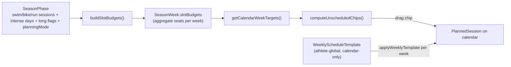

# Phase-aware weekly templates — strategy

**Status:** **Confirmed direction (Option B).** Extend the existing `WeeklyScheduleTemplate` into a **plan-scoped, per-phase** template model that **auto-materializes** onto calendar weeks when defined. No new weekday-grid schema, no anchors.

**Supersedes:** the earlier "season-owned weekday × discipline layout" plan (option 2) and all references to anchor workouts and the 5-step plan wizard. See [Why the earlier plan changed](#why-the-earlier-plan-changed).

**Related:** [calendar-workout-pool-v2.md](./calendar-workout-pool-v2.md) (slot budgets + workout pool)

---

## Why the earlier plan changed

The previous version of this doc assumed a **5-step plan wizard**, **anchor workouts**, and a **season-owned weekday × discipline grid** (`SeasonPhaseLayoutItem`) materialized to the calendar. **None of that shipped:**

| Earlier plan | Production reality |
|--------------|--------------------|
| 5-step plan wizard (`SeasonSetupStep` … `VolumeRampDeloadStep`) | **Never shipped.** Prod is the single-page **Simple Planner** at `/plan` (`src/components/simple-planner/*`) |
| Anchor workouts (`AnchorWorkout`, `materializeAnchorsForWeek`, `ANCHORED_INSTANCE`) | **Dropped** (`prisma/migrations/**/manual_drop_anchors.sql`). `PlannedSessionSource` is `FLEXIBLE | TEMPLATE | RACE` |
| Season-owned weekday grid (`SeasonPhaseLayoutItem`) | **Never built.** No schema, no materializer |
| Athlete template = "import preset" into phase layout | Athlete-global template, **calendar-only**, applied per week; **no** coupling to seasons |
| `SeasonWeek.swimSessions` as budget source | Those columns are **written as 0**; budget comes from **`SeasonPhase.*SessionsPerWeek` + intense days → `SeasonWeek.slotBudgets`** |
| `ZoneAllocationStep` (explicit zone minutes) | Only **phase zone-split percents** → `SeasonWeek.zoneMinutes` |

The season → calendar bridge that **did** ship is **aggregate slot budgets**, not a materialized grid (see next section). This doc re-plans the "usual week" capability on top of that reality.

The dead planning docs are retained but marked superseded: [plan-wizard-implementation-plan.md](./plan-wizard-implementation-plan.md), [plan-wizard-pain-points.md](./plan-wizard-pain-points.md), [plan-wizard-screen-spec.md](./plan-wizard-screen-spec.md).

---

## What exists today (production)



| Layer | Model / code | Scope | Drives calendar? |
|-------|--------------|-------|------------------|
| **Season targets** | `SeasonWeek` via Simple Planner (`simple-planner.server.ts`) | Per season week | Indirectly — stores `slotBudgets`, `zoneMinutes`, `longSessionZoneMinutes`, long minutes |
| **Slot budgets** | `buildSlotBudgets` / `computeCalendarWeekPoolFields` (`simple-week-compute.ts`) | Per week, per discipline | Yes — typed **unscheduled chips** (`ENDURANCE / INTENSITY / LONG / SUBSTITUTE_ENDURANCE`) |
| **Weekly template** | `WeeklyScheduleTemplate` · `applyWeeklyTemplate` (`template.server.ts`) | One per **athlete** | Yes — on demand, per week (`source: TEMPLATE`) |
| **Races** | `GoalEvent` · `syncRaceToCalendar` | Per season | Yes — `source: RACE` |

**Key point:** slot budgets are **aggregate counts per week** ("1 intense bike this week"), never a weekday shape ("intense bike on Tuesday"). The athlete places each session by hand, or applies the athlete-global weekly template. That template is **phase-blind** — the same "usual week" for Base and Race prep.

---

## The gap this plan closes

| Gap | Detail |
|-----|--------|
| **No weekday shape from the plan** | Slot budgets never say which day; every week starts empty except a manual template apply |
| **Weekly template is phase-blind** | One athlete-global template; can't vary the usual week by phase |
| **Intensity-day placement is manual** | Intense chips carry a role, but which day is "hard day" isn't planned; pool intensity-recipe suggestions have nothing to anchor to |
| **No recurring "standard week"** | No per-phase "this is my normal Base week" that auto-fills |

---

## Direction: Option B — phase-aware weekly templates

Do **not** build a new `SeasonPhaseLayoutItem` grid. Instead evolve the **existing** `WeeklyScheduleTemplate` (already a weekday × discipline grid with `sessionRole`, an apply engine, and slot counting) into a **plan-scoped, typed** model that **auto-materializes** when defined.

| Rejected alternative | Why |
|----------------------|-----|
| **A — retire templates entirely** (slot budgets + manual placement only) | Leaves the weekday-shape and phase-variation gaps unsolved |
| **C — full season-owned weekday grid** (`SeasonPhaseLayoutItem` + materializer) | Duplicates the weekly-template editor, re-introduces the pinned-vs-flexible tension the pool was built to avoid, highest cost |

**Templates are layout-only.** They define *which sessions on which weekday* and their `sessionRole`. They never own volume or zone budget — the Simple Planner ramp/deload engine keeps owning `totalHours` / `zoneMinutes` / `slotBudgets`. (The one nuance is test weeks; see below.)

---

## Template taxonomy

Three template scopes, resolved per week by precedence:

| Scope | Bound to | Applies to | Count |
|-------|----------|------------|-------|
| **Phase template** | a specific `SeasonPhase` | every normal week in that phase | 0–1 per phase |
| **Rest / de-load template** | the season plan | de-load / rest weeks | 0–1 per season |
| **Test week template** | the season plan, **scheduled** onto chosen week(s) | only the week(s) it is placed on | 0–1 definition, N placements |

Per **phase** (not per phase kind): real weekly patterns don't map cleanly onto Base/Build/Race-prep, and two Base blocks may want different weeks.

### Per-week resolution (precedence)

```
scheduled test week   → test template   · TiZ OFF (except long in mode 4)
de-load / rest week    → season rest template IF defined, else the phase template · layout-only, de-load engine scales the budget
normal week            → phase template IF defined, else empty (slot-budget chips only)
```

---

## Materialization rules

- **Auto-materialize**, but **never mandatory.** A week only receives sessions if a template resolves for it. Undefined → the week stays empty and the athlete works from slot-budget chips (today's behavior).
- **Empty-week-only.** Auto-apply fires only when the week has no planned sessions, so it never clobbers manual placement or a prior apply. Re-apply remains an explicit, manual action.
- **Reconcile against `slotBudgets`.** After apply, leftover seats still surface as unscheduled chips — the existing loop. Template placement just pre-fills the weekday shape and intensity days.
- Respects long-week / taper / rest suppression already handled by `computeCalendarWeekPoolFields`.

---

## Special weeks

### Rest / de-load weeks — layout-only

- The de-load engine still owns the budget: `deLoadVolumePercent` + `applyDeLoadIntensityShift` compute the reduced `totalHours` / `zoneMinutes` as they do today.
- Resolution is either/or: if a **season rest template** is defined, rest weeks use it; otherwise they fall back to the **phase** template.
- Either way the template only pre-places the (already reduced) week's session shape. Slot budgets, chips, and Week TiZ behave normally, just scaled down.

### Test weeks — outside the TiZ system

Test weeks are a genuine special case: **TiZ planning does not apply.**

- **No zone-minute budget / no TiZ targets** on test-week sessions. Skip `inheritTargetZonesFromRole`, skip the endurance/intensity slot budgets, and show the Week TiZ rollup as **N/A** for that week.
- The template defines the week as **test + supporting sessions** (warm-up, primers, openers, recovery around the test) — no normal endurance/intensity distribution.
- **Long workouts may still exist.** They are the one thing that persists from normal planning, and they **may still carry TiZ targets in planning mode 4 (`SEPARATE_LONG_TIZ`)** — drawn from the separate `longSessionZoneMinutes` budget. In modes 1–3 the surviving long is duration-only.
- **Slot budgets on a test week:** suppress endurance/intensity seats; **keep the long seat** when long workouts still apply.
- **Schedulable on the timeline:** the athlete drops a test week onto a week index (alongside race markers / de-load flags).
- **Actual load still counts.** Completed test-week sessions still produce real training load (ECO / impulse); they are simply not *planned* via TiZ.

---

## Relationship to the workout pool

Templates pre-fill the week; the pool fills the remaining gap. Template **intensity slots** become the anchor points for the pool's intensity-recipe suggestions (see [calendar-workout-pool-v2.md](./calendar-workout-pool-v2.md), pool phases P3/P4). Reconciliation against `slotBudgets` is unchanged: manual sessions and template sessions both reduce the unscheduled chip counts.

### TiZ seeding is being superseded

When a session is placed or materialized it currently seeds provisional `targetZones` via `inheritTargetZonesFromRole` (`src/lib/plan/calendar/inherit-target-zones.ts`) — a fixed per-role zone split (`ROLE_ZONE_SHARE`). **This is a first-pass heuristic, not the target behavior**, and templated sessions should not entrench it:

- **Intensity slots** — the fixed `INTENSITY` split (55% Z3 / 30% Z4 / 15% Z5, applied identically to every hard session) does **not** reflect how athletes train. It is superseded by **intensity recipes** (over/under, tempo, threshold, VO2) that claim the week's hard budget asymmetrically — pool phase **P3**.
- **Easy / moderate / long** — per-session role shares (notably `MODERATE = 100% Z2`, so endurance sessions never inherit Z1) are superseded by **week distribute/balance** that pours remaining Z1/Z2 to reconcile the week `zoneMinutes` pie — pool phase **P4** (generalizing `computeEasyTizSpread`).
- **Keep:** the `LONG` + mode 4 (`SEPARATE_LONG_TIZ`) path that already allocates from the real `longSessionZoneMinutes` budget.

Net: on materialize, defer to **recipes** (intensity) and **week-distribute** (easy/long); demote `inheritTargetZonesFromRole` to a fallback when no recipe or budget is available. Whether TiZ re-seeds on role change / workout attach (today it does not) is resolved by that same distribute pass.

---

## Proposed work sequence

| Step | Scope |
|------|-------|
| **S1 — Doc reconciliation** | This rewrite; mark the three wizard docs superseded; scrub anchor/grid language from calendar docs |
| **S2 — Template schema** | Move `WeeklyScheduleTemplate` from athlete-global to **plan-scoped + typed**: `seasonPhaseId` (nullable) + `kind` (`PHASE \| REST \| TEST`); test-week placements as scheduled rows on the plan. Migration + **migrate the legacy athlete-global template** into a default/per-phase template |
| **S3 — Editors in the planner** | Reuse `weekly-template-editor.tsx` to define phase / rest / test templates from the Simple Planner |
| **S4 — Test-week scheduling** | Timeline control to place test weeks (next to race markers / de-load flags) |
| **S5 — Resolver + auto-materialize** | Per-week precedence resolver; auto-apply on empty weeks; reconcile to slot budgets |
| **S6 — Intensity-day handoff** | Template intensity slots feed the pool's intensity-recipe suggestions |

---

## Decisions (confirmed)

| Item | Decision |
|------|----------|
| Approach | **Option B** — extend `WeeklyScheduleTemplate`; no new grid schema, no anchors |
| Template scope | **Per phase** (not per phase kind) |
| Special templates | **Rest** (season-level) + **Test** (season-level, schedulable) |
| Materialization | **Auto**, **non-mandatory**, **empty-week-only**, reconciled to `slotBudgets` |
| Template ownership of budget | **Layout-only** for normal + rest weeks; test weeks sit **outside** TiZ |
| Rest-week resolution | Season rest template **if defined**, else the phase template |
| Test-week long TiZ | Allowed **only in mode 4** (`SEPARATE_LONG_TIZ`) via `longSessionZoneMinutes`; duration-only otherwise |
| Legacy athlete-global template | **Migrated** into the plan-scoped model |
| Anchors | **Retired** — key sessions are `GoalEvent`/races or template intensity slots |
| 5-step wizard | **Retired** — Simple Planner is the season editing surface |

## Open items

- [ ] Schema shape for `kind` + `seasonPhaseId` + test-week placement rows (S2)
- [ ] Whether S6 recipe anchoring lands with S5 or after the pool P3/P4 work
