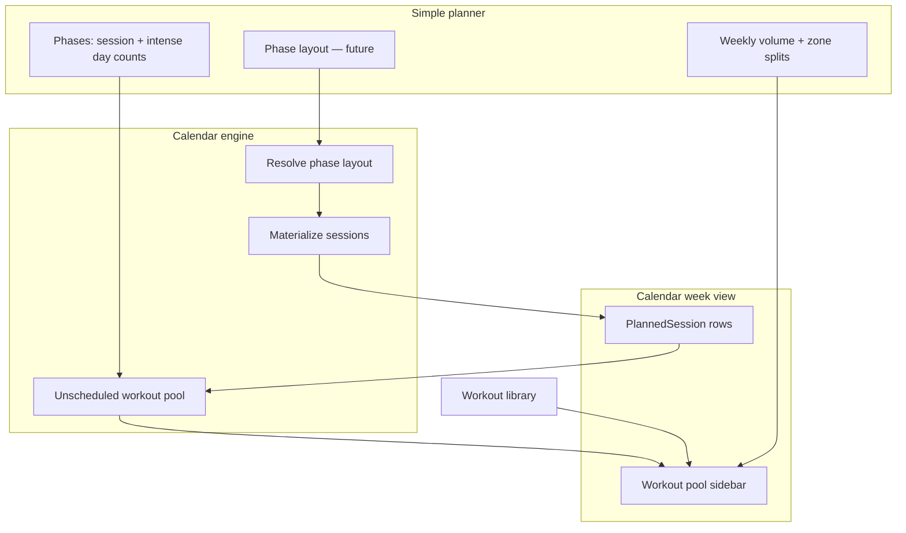

# Weekly template vs season phase layout

**Status:** Layout strategy unchanged (option 2). **Anchor workouts removed from the product.** See [season-planner-unified-plan.md](./season-planner-unified-plan.md) and [calendar-workout-pool-v2.md](./calendar-workout-pool-v2.md).

**Option 2 confirmed** — season plan owns week layout per phase (not built). Gaps → unscheduled workouts on calendar (**shipped**).

---

## Decision summary (confirmed)

| Topic | Choice |
|-------|--------|
| Layout owner | **Season plan / `SeasonPhase`** — per-phase week grid (option 2) |
| Athlete `WeeklyScheduleTemplate` | **Import preset only** when building season layout; manual apply per week until layout ships |
| Phase session counts | **Weekly budget / target** in planner Phases pane — **not** a constraint on layout |
| Layout vs budget gap | **No validation** — calendar shows **unscheduled workouts** for the week |
| Recurring structure | **Phase layout** (future V2f) — not anchor workouts (removed) |

---

## What exists today (production)

| Layer | Model / code | Scope | Drives calendar? |
|-------|----------------|-------|------------------|
| **Season targets** | `SeasonWeek` via simple planner save + zone split recompute | Per season week | **Yes** — week targets, pool budget, TiZ footer |
| **Phase intent** | `SeasonPhase` + coachNotes (sessions/week, intense days, zone splits) | Per phase span | **Yes** — via `week-targets.server.ts` |
| **Weekly template** | `WeeklyScheduleTemplate` · `applyWeeklyTemplate` | One per **athlete** | Yes — on demand per week — `source: TEMPLATE` |
| **Workout pool** | Unscheduled + suggested + library | Per calendar week | **Yes** — closes budget vs scheduled gap |
| **Phase layout** | `SeasonPhaseLayoutItem` | Per phase | **Not built** — target schema |

**Simple planner Phases pane** sets the **weekly session budget** and **intense day counts** per discipline.  
**Phase layout (future)** defines **which weekdays** those sessions land on and their **sessionRole**.  
**Weekly volume table** sets hours, rest weeks, and drives computed zone minutes.

---

## North star flow



### 1. Week layout (primary job — season-owned, not built)

Each `SeasonPhase` will have a **week layout**: weekday × discipline slots.

- Defines *which* sessions exist on the grid when materialized
- **Does not** need to match phase session counts — athlete may schedule 2 swims when budget is 3
- Each slot carries **sessionRole** (`easy`, `moderate`, `intensity`, `long`) — see [calendar-workout-pool-v2.md](./calendar-workout-pool-v2.md)
- Optional later: rest-day hints, brick pairing

Athlete global `WeeklyScheduleTemplate` → **“Import preset”** copies into a phase layout when editor ships; until then, template is applied manually per calendar week.

### 2. Calendar materialization (future — V2f)

On season save or per-week refresh:

1. Resolve **phase layout** for the week (from `SeasonPhase`)
2. Materialize **layout slots** → `PlannedSession` (`source: LAYOUT` or extend `TEMPLATE` linkage)
3. Attach duration / zone targets from `SeasonWeek` + per-slot overrides and `sessionRole`

No anchor materialization step — anchors are removed from the product.

### 3. Unscheduled workouts (shipped)

Phase budgets and calendar sessions are **intentionally decoupled**. The pool closes the loop:

| Concept | Source |
|---------|--------|
| **Budget** | Phase `*SessionsPerWeek` (+ strength) for the active week |
| **Scheduled** | Count of non-race `PlannedSession` per discipline (manual, template, layout, etc.) |
| **Unscheduled** | `max(0, budget − scheduled)` per discipline |

**Calendar UX:** Sidebar workout pool — unscheduled chips + suggested + library. Details: [calendar-workout-pool-v2.md](./calendar-workout-pool-v2.md).

- No wizard or planner validation that layout matches budget
- Flexible sessions the user adds manually **reduce** the unscheduled count
- Deleting a session **increases** unscheduled count
- De-load / rest weeks: budget and zone minutes already scaled on `SeasonWeek`

---

## Layout slot vs weekly template item

| | Layout slot (`SeasonPhaseLayoutItem`) | Weekly template item |
|--|--------------------------------------|----------------------|
| **Intent** | Season-owned weekday placeholder | Athlete-global week skeleton |
| **Scope** | Per `SeasonPhase` | Per athlete |
| **Recurrence** | Materialized each week in phase date range | Applied on demand per calendar week |
| **Calendar source** | `LAYOUT` (planned) | `TEMPLATE` |
| **sessionRole** | Set on slot | On template item (preset) |
| **Edit on calendar** | Detach / override | Overwritten on re-apply |

**Import preset:** copy template rows into phase layout when the layout editor ships.

---

## Phased delivery

| Phase | UX | Backend | Status |
|-------|-----|---------|--------|
| **Calendar V2a–V2c** | Workout pool sidebar | Unscheduled, suggested, library, sessionRole | **Shipped** |
| **P1** | Import from weekly template → phase layout draft | `SeasonPhaseLayoutItem` schema | Next |
| **P2** | Phase layout editor in simple planner Phases pane | CRUD on season layout | Next |
| **P3** | `materializeSeasonWeek` from layout only | Orchestrator | Next |

---

## Unscheduled workouts — example

Base phase budget = 3 swim, 4 bike, 3 run. Calendar has 2 swims, 3 bikes, 3 runs (manual + template).

```
Budget (phase)          Scheduled (calendar)    Unscheduled pool
───────────────────     ────────────────────    ─────────────────
Swim  3                 Swim  2                 Swim  1
Bike  4                 Bike  3                 Bike  1
Run   3                 Run   3                 (none)
```

**Out of scope:** Auto-inserting sessions to fill the pool without user action.

---

## Review checklist

- [x] Layout owner: season plan per phase (option 2)
- [x] No layout validation against session budgets
- [x] Gaps → unscheduled workouts on calendar (pool shipped)
- [x] Anchors removed from product
- [ ] Schema shape for `SeasonPhaseLayoutItem`
- [ ] Phase layout editor in simple planner
- [x] Unscheduled UI: left sidebar workout pool
- [x] `sessionRole` enum — [calendar-workout-pool-v2.md](./calendar-workout-pool-v2.md)
