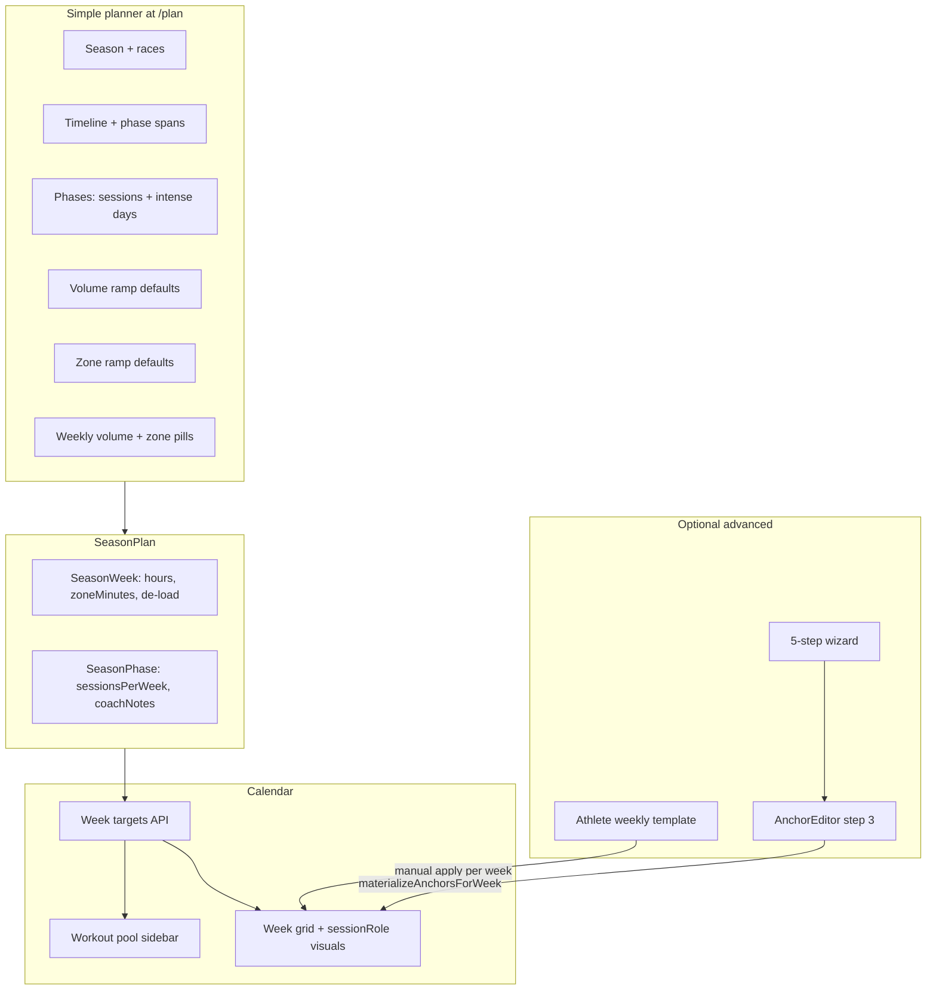

# Season planner + calendar — unified plan

**Status:** Living plan (July 2026). Supersedes wizard-only assumptions in older docs.

**Related:**

- [calendar-workout-pool-v2.md](./calendar-workout-pool-v2.md) — pool sidebar spec (partially shipped)
- [plan-wizard-weekly-template-strategy.md](./plan-wizard-weekly-template-strategy.md) — layout vs budget strategy

---

## Unification summary (shipped)

Two season planners are **unified at the data and routing layer**:

| Surface | Flag | Route | Role |
|---------|------|-------|------|
| **Simple planner** (primary) | `FEATURE_SIMPLE_SEASON_PLANNER=true` | `/plan` | Single-page season editor; **calendar source of truth** |
| **Advanced wizard** (optional) | `FEATURE_ADVANCED_SEASON_PLANNER=true` | `/plan/setup?seasonId=…` | Legacy 5-step wizard; link from simple planner as “Advanced settings” |

When simple is on and advanced is off:

- `/plan/setup` → redirects to `/plan`
- `/plan/settings/*` → redirects to `/plan`

**One season model:** `SeasonPlan` + `SeasonPhase` + `SeasonWeek`, loaded via `getSimplePlannerSeason` and `serializeSimpleSeasonPlan`. Calendar week targets (`week-targets.server.ts`) read **only** from this serializer — not from the advanced wizard or `focus-tiz` presets.

---

## Architecture today



---

## Simple planner ↔ old wizard mapping

The v2 wizard step order is **absorbed** into collapsible sections on `/plan`:

| Simple planner section | Old wizard step | Shipped |
|------------------------|-----------------|---------|
| Season + Races | 0 — Season setup | Yes |
| Timeline + Phases (spans on week table) | 1 — Cycle structure (simplified; no mesocycle editor) | Yes |
| Phases pane: sessions/week, **intense days/week**, per-discipline ramp toggles | 2 — Goals & training days | Yes |
| Ramp defaults + Weekly volume table | 4 — Volume, ramp & de-load | Yes |
| Zone ramp defaults + per-week zone pills | Was “V2 zone allocation” in wizard docs | **Yes** (simple-tiz) |
| — | 3 — Workouts & templates (anchors, layout) | **Not in simple planner yet** |

**Implication:** Zone minutes by discipline are **not deferred** — they ship in the simple planner week table. The wizard doc “V2 zone allocation” epic is obsolete for the unified path; keep `focus-tiz` only for advanced-only seasons.

---

## Three planning layers (intent → shape → execution)

### Layer 1 — Phase intent (shipped)

Per `SeasonPhase` in the **Phases** pane:

- `swimSessionsPerWeek`, `bikeSessionsPerWeek`, `runSessionsPerWeek`, `strengthSessionsPerWeek`
- `swimIntenseDaysPerWeek`, `bikeIntenseDaysPerWeek`, `runIntenseDaysPerWeek`
- Phase goal (text), ramp-enabled toggles per discipline

Stored on phase rows + `coachNotes` JSON (`simple-phase-notes.ts`).

**Feeds calendar:**

- Session **budget** → unscheduled chips (`max(0, budget − scheduled)`)
- **Intense day counts** → suggested workout cardinality (`generate-workouts.ts` splits hard-zone budget across N days)
- Phase **color/name** → week target phase pill

### Layer 2 — Week shape (not shipped)

Per-phase **week layout grid** (Mon–Sun slots), season-owned:

```typescript
// SeasonPhaseLayoutItem (schema TBD)
{ weekday, discipline, title, sessionRole, durationMinutes?, sortOrder }
```

- Athlete `WeeklyScheduleTemplate` = **import preset only** (copy into phase layout once)
- Layout **intense** slots should soft-match `*IntenseDaysPerWeek` counts — no wizard blocking
- Materialize → `PlannedSession` with `sessionRole`, `source: LAYOUT` (or extend `TEMPLATE` linkage)

**UI home:** new subsection under **Phases** in simple planner (not wizard step 3, not athlete-global template as runtime source).

### Layer 3 — Execution (mostly shipped)

| Feature | Status | Code |
|---------|--------|------|
| Unscheduled chips | Shipped | `unscheduled-chips.ts`, `workout-pool.tsx` |
| Suggested intervals from hard-zone budget ÷ intense days | Shipped | `pool-budgets.ts`, `generate-workouts.ts` |
| Library browse + drag to day/session | Shipped | `pool-library-section.tsx` |
| Unscheduled + library combo drops | Shipped | `pool-unscheduled-attachment.ts`, `planning-calendar.tsx` |
| `sessionRole` on sessions + calendar visuals | Shipped | `session-role.ts`, `calendar-session-card.tsx` |
| Role bump when applying hard workout | Shipped | `apply-workout-template.ts` |
| Week TiZ footer in pool | Shipped | `workout-pool.tsx` (rollup vs `SeasonWeek.zoneMinutes`) |
| Library filter by intensity day / selected session | **Not shipped** | — |
| Default TiZ on layout materialize from role | **Not shipped** | — |
| Auto materialize season layout each week | **Not shipped** | — |

---

## Intensity: two complementary models

| Model | Where | Question it answers | Pool use |
|-------|-------|---------------------|----------|
| **Intense day count** | Simple planner phase pane | “How many hard sessions per discipline this phase?” | **How many** suggested interval cards; split hard TiZ |
| **Session role on slot** | Layout item or `PlannedSession` | “Which weekday is the hard bike day?” | **Which day** to boost library / show ⚡ badge |

**Unified rules:**

1. **Counts are canonical intent** — already in simple planner; do not duplicate as a wizard-only concept.
2. **Layout assigns counts to weekdays** — when Layer 2 ships, materialize `INTENSITY` on the right slots.
3. **No layout yet** — pool works from counts; users set `sessionRole` on calendar cards manually or via workout apply (shipped).

---

## Calendar workout pool — revised phases

| Phase | Scope | Status |
|-------|--------|--------|
| **V2a** | Sidebar: unscheduled chips; drag to day | **Shipped** |
| **V2b** | Library browse; drag template to day/session | **Shipped** |
| **V2b+** | Combo: drop workout on unscheduled chip; arm chip → place | **Shipped** |
| **V2c** | `sessionRole` visuals on calendar; cycle role on card | **Shipped** |
| **V2c+** | Template editor + weekly template `sessionRole` | **Shipped** (athlete preset; not season layout) |
| **V2d** | Pool library/suggested filtered by selected day + intensity context | **Next** |
| **V2e** | Default TiZ on placement / layout materialize from role + week zones | **Next** |
| **V2f** | Phase week layout editor + `materializeSeasonWeek` | **Next** |

---

## Recommended build order (post-unification)

| # | Work | Unlocks |
|---|------|---------|
| 1 | **Anchors** section in simple planner (embed `AnchorEditor` or link + scope) | Unified UX without requiring advanced wizard |
| 2 | **`SeasonPhaseLayoutItem`** schema + API + import from athlete template | Season-owned week shape |
| 3 | **Week layout editor** in simple planner Phases pane | Which days are long / intensity |
| 4 | **`materializeSeasonWeek`** (anchors + layout → calendar) | Grid fills from season automatically |
| 5 | **Pool context** — selected day + layout roles → library/suggested filter | Intensity slots drive suggestions |
| 6 | **Default TiZ on materialize** from `sessionRole` + `SeasonWeek.zoneMinutes` | Placeholder sessions arrive with targets |
| 7 | Deprecate advanced wizard when simple planner reaches parity | Single planner surface |

---

## Decisions (confirmed, post-unification)

| Topic | Decision |
|-------|----------|
| Primary planner UX | **Simple planner** at `/plan` |
| Calendar week targets | **`serializeSimpleSeasonPlan` only** |
| Session budget vs layout | **Decoupled** — gaps → unscheduled chips; no wizard validation |
| Zone allocation | **Simple planner week table + zone ramps** (not a future wizard step) |
| Intensity planning | **Intense day counts** in phase pane + **sessionRole** on slots/sessions |
| Athlete weekly template | **Import preset** into season layout; manual apply remains for ad-hoc weeks |
| Layout owner | **`SeasonPhase`** per-phase grid (option 2) — editor not built yet |
| Advanced wizard | **Optional** via `FEATURE_ADVANCED_SEASON_PLANNER`; not the calendar driver |

---

## Open items

- [ ] Tabs vs scrollable sections in workout pool (still TBD)
- [ ] Layout optional vs required per phase
- [ ] Mismatch UX when layout intense slots ≠ `*IntenseDaysPerWeek` (calendar warn only?)
- [ ] Mesocycles: keep in advanced wizard only, or drop for simple phase spans
- [ ] Brick / multisport slots (future)
