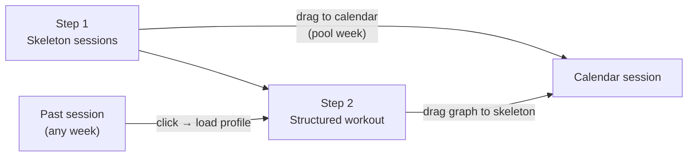
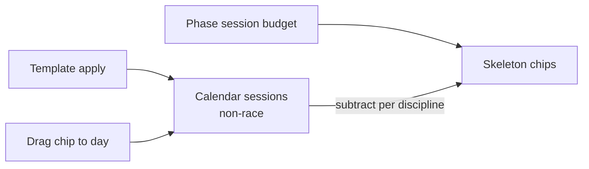
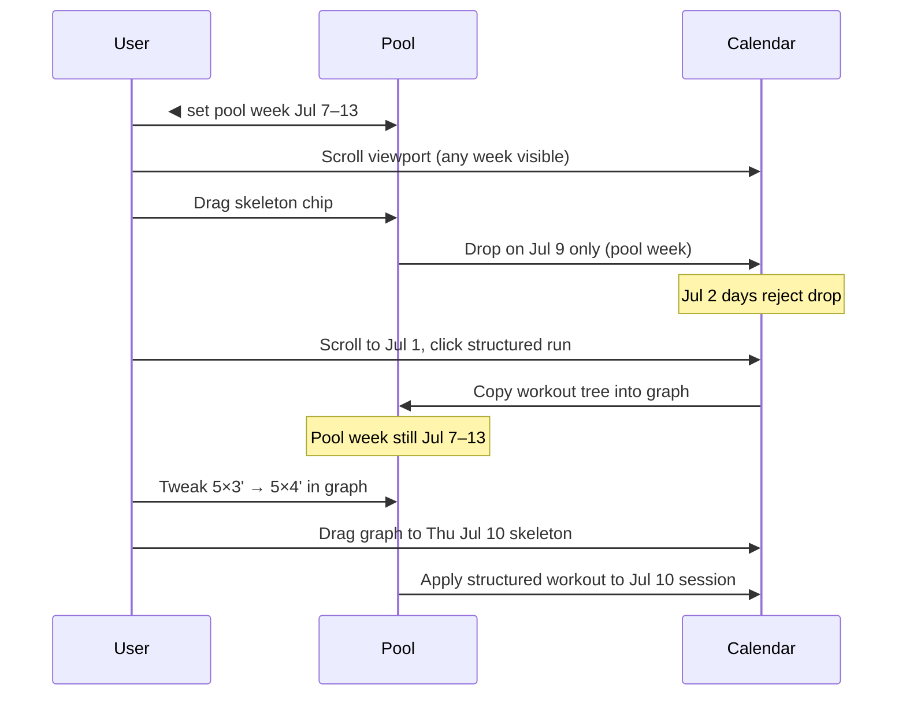

# Workout pool wizard — wireframe

**Status:** Design wireframe (not implemented). Evolves the shipped left-sidebar pool ([calendar-workout-pool-v2.md](./calendar-workout-pool-v2.md)).

**Concept:** A **wizard-like workout pool** pinned to the **top** of the planning calendar. The pool has its **own week selector** (independent of which week is scrolled into view on the calendar). Athletes build the week in two steps: **skeleton sessions** first, then **structured workouts** assembled from library components.

---

## Layout overview

```
┌─────────────────────────────────────────────────────────────────────────────┐
│  WORKOUT POOL (sticky)                                                      │
│  ┌───────────────────────────────────────────────────────────────────────┐  │
│  │  ◀  Jul 7 – Jul 13, 2026  ▶     [ Skeleton ] [ Build ]  (tabs)          │  │
│  │  (pool week — independent of calendar scroll)                         │  │
│  └───────────────────────────────────────────────────────────────────────┘  │
│  … step content (see below) …                                               │
├─────────────────────────────────────────────────────────────────────────────┤
│  CALENDAR (scrollable, multi-week)                                          │
│  ┌─ last week ─────────────────────────────────────────────────────────┐   │
│  │  M   T   W   T   F   S   S                                          │   │
│  └─────────────────────────────────────────────────────────────────────┘   │
│  ┌─ this week ────────────────────────────────────────────────────────┐   │
│  │  … sessions …                                                       │   │
│  └─────────────────────────────────────────────────────────────────────┘   │
│  ┌─ next week ─────────────────────────────────────────────────────────┐   │
└─────────────────────────────────────────────────────────────────────────────┘
```

| Zone | Behavior |
|------|----------|
| **Pool header** | Sticky; always visible while scrolling calendar |
| **Pool week** | `◀` / `▶` changes **target week** for all pool actions |
| **Calendar scroll** | Independent — user can scroll to any week to view history |
| **Drop constraint** | Pool items may **only** drop onto days in the **pool-selected week** |
| **Load from history** | Click any past session with a structured workout → copies its profile into **this pool week’s** workout graph (step 2); does **not** change pool week or edit the past session |

---

## Wizard steps



| Step | Goal | Output |
|------|------|--------|
| **1 — Skeleton** | Drag **unscheduled chips** onto calendar days; **compact role picker** on drop | `PlannedSession` rows (flexible, no structured workout yet) |
| **2 — Build** | Assemble warm-up + main + cool-down into a **workout graph**, assign to a skeleton on the pool week | `StructuredWorkout` linked to session |

Steps are **tabs** (**Skeleton** | **Build**), not a forced linear wizard — user can switch anytime. Default tab after pool week change: Skeleton if unscheduled chips remain, else Build.

**Desktop only:** The sticky top workout pool (tabs + graph builder) is **not** implemented on mobile viewports for now — athletes use the existing calendar on mobile without the pool wizard chrome.

**Strength / gym:** Included in **step 1** skeleton chips and weekly template (discipline `STRENGTH`). **Out of scope for step 2** — no structured workout graph, warm-up/main/cool-down columns, or library assign for strength sessions.

---

## Step 1 — Skeleton sessions

**Purpose:** Place empty sessions on the calendar before building structured workouts in step 2.

**Skeleton chips are the unscheduled budget** — not a separate palette. Chip count and discipline come from the same math as shipped `computeUnscheduledChips`: phase session budget minus everything already on the calendar for that pool week.

### Unscheduled budget math

```
unscheduled[discipline] = max(0, phaseSessionsPerWeek − scheduledCount)
```

| Input | Source |
|-------|--------|
| **Budget** | Active phase `swim/bike/run/strengthSessionsPerWeek` on `SeasonWeek` targets |
| **Scheduled** | Count of **all non-race** `PlannedSession` rows that week, **any source** |

**What counts as scheduled (reduces chips):**

| Source | Counts? |
|--------|---------|
| Manual / flexible placement | Yes |
| Weekly template apply (`source: TEMPLATE`) | **Yes** |
| Phase layout materialize (future `LAYOUT`) | Yes |
| Sessions with structured workout already | Yes (still a placed session) |
| Goal races (`source: RACE`) | **No** — excluded from budget math |

### Example — template + budget

Phase budget: **3 swim**, 4 bike, 3 run. Athlete applies weekly template with **2 swims** on Mon and Thu.

```
Budget          Scheduled (incl. template)     Skeleton chips (pool)
────────        ──────────────────────────     ─────────────────────
Swim  3        Swim  2                         Swim ×1
Bike  4        Bike  0                         Bike ×4
Run   3        Run   0                         Run ×3
```

Only **one** swim chip remains. Applying the template does not bypass the budget — templated sessions **are** scheduled sessions.



Chip list **recomputes** when: pool week changes, planner targets change, template applied/removed, or any session added/deleted on that week.

### Wireframe

```
┌─────────────────────────────────────────────────────────────────────────────┐
│  POOL — Step 1                                                              │
│  ◀  Jul 7 – Jul 13, 2026  ▶   [ Skeleton ● ] [ Build ]                     │
│                                                                               │
│  Skeleton chips (= unscheduled budget for this pool week)                    │
│  ┌──────┐ ┌──────┐ ┌──────┐ ┌──────┐ ┌──────┐ ┌──────┐ ┌──────┐ ┌──────┐   │
│  │ Swim │ │ Bike │ │ Bike │ │ Bike │ │ Bike │ │ Run  │ │ Run  │ │ Str  │   │
│  └──────┘ └──────┘ └──────┘ └──────┘ └──────┘ └──────┘ └──────┘ └──────┘   │
│  (after template with 2 swims on a 3-swim week → only 1 Swim chip above)     │
│                                                                               │
│  Empty state: "All budgeted sessions are on the calendar."                   │
└─────────────────────────────────────────────────────────────────────────────┘
┌─────────────────────────────────────────────────────────────────────────────┐
│  CALENDAR — pool week row (drops accepted); other weeks reject               │
│       Mon      Tue      Wed      Thu      Fri      Sat      Sun              │
│     ┌──────┐ ┌──────┐ ┌──────┐ ┌──────┐ ┌──────┐ ┌──────┐ ┌──────┐         │
│     │ 🏊   │ │      │ │      │ │ 🏊   │ │      │ │      │ │      │         │
│     │ tpl  │ │      │ │      │ │ tpl  │ │      │ │      │ │      │         │
│     └──────┘ └──────┘ └──────┘ └──────┘ └──────┘ └──────┘ └──────┘         │
│                    ↑ template sessions — already counted                     │
└─────────────────────────────────────────────────────────────────────────────┘
```

Chips are **discipline-only** labels (one chip = one remaining session slot). There is no “spawn extra chip” control — the list is purely derived from budget minus scheduled.

### Session role on placement (confirmed)

Skeleton sessions carry a **role** (`easy | moderate | intensity | long`). Role is **not** on the chip; it is chosen in a **compact picker at drop time**.

**Flow:** drag chip → drop on calendar day → popover at drop point:

```
┌─────────────────────────┐
│  Run on Thursday        │
│  ┌────┐ ┌────┐ ┌────┐ ┌────┐ │
│  │Easy│ │Mod.│ │Int.│ │Long│ │  ← default highlight: Moderate
│  └────┘ └────┘ └────┘ └────┘ │
│  [ Cancel ]    [ Place ]      │
└─────────────────────────┘
```

| Behavior | Detail |
|----------|--------|
| **Default** | `moderate` pre-selected; Enter or **Place** confirms |
| **Cancel** | No session created; chip stays in pool |
| **After place** | Role badge on card (shipped V2c); badge click still cycles role for quick fixes |

Role does not affect chip count — only discipline matters for unscheduled math.

### Interactions

| Action | Result |
|--------|--------|
| Drag **skeleton chip** onto **calendar day** (pool week only) | **Role picker** opens; on confirm, creates `PlannedSession` with discipline + `sessionRole`; chip removed |
| Apply **weekly template** to pool week | Template sessions appear with **roles from template setup**; chips recomputed (e.g. 3 swim budget − 2 template swims → 1 chip) |
| Drop on day outside pool week | Rejected — no highlight on non-pool weeks |
| Delete session on calendar | Scheduled count drops; matching discipline chip **reappears** |
| All budget placed | No chips; same copy as today: “All budgeted sessions are on the calendar.” |

Reuses `computeUnscheduledChips` / `countScheduledSessionsByDiscipline` — wizard UI is a new presentation, not new math.

### Skeleton card (on calendar)

```
┌─────────────────┐
│  Run            │
│  ⚡ Intensity    │  ← sessionRole badge (shipped V2c)
│  (no workout)   │
└─────────────────┘
```

Uses existing `SessionRole`: `easy | moderate | intensity | long`.

### Weekly template roles (`/calendar/template`)

Template setup is the **other** way skeleton sessions get a role — no drop picker when applying a template.

| Surface | Role UX |
|---------|---------|
| **Weekly template editor** | Each `WeeklyScheduleTemplateItem` has a **Role** field with definitions (easy / moderate / intensity / long) |
| **Apply template** | `PlannedSession.sessionRole` copied from the template item (`template.server.ts`) |
| **Skeleton chip drop** | Role chosen via **compact picker** (above) — only for sessions placed from unscheduled chips |

Template roles use the same enum and descriptions as the skeleton drop picker (`SESSION_ROLE_DESCRIPTIONS` in `session-role.ts`). Intensity and long sessions show the same calendar badges after apply.

**Example:** Tuesday template slot = Run · **Intensity** → apply template → Tue run card shows ⚡ Intensity without an extra picker step.

---

## Step 2 — Structured workout builder

**Discipline filter** at top, **three component columns** in a row, **workout graph** full-width below (per whiteboard sketch), then assign to a skeleton on the pool week.

### Wireframe

```
┌─────────────────────────────────────────────────────────────────────────────┐
│  ◀  Jul 7 – Jul 13, 2026  ▶   [ Skeleton ] [ Build ● ]                      │
├─────────────────────────────────────────────────────────────────────────────┤
│  Discipline   [ Swim ]  [ Bike ]  [ Run ]          Manage library →          │
├──────────────────┬──────────────────┬──────────────────┬─────────────────────┤
│  WARM-UP         │  MAIN SET        │  COOL-DOWN       │  + Custom interval │
│                  │                  │                  │                     │
│  ┌────────────┐  │  ┌────────────┐  │  ┌────────────┐  │                     │
│  │ ▁▂▃▄       │  │  │ ▃▅▃▅▃▅     │  │  │ ▄▃▂▁       │  │                     │
│  │ 10' Z2     │  │  │ 5×3' Z4    │  │  │ 5' Z1      │  │                     │
│  └────────────┘  │  └────────────┘  │  └────────────┘  │                     │
│  ┌────────────┐  │  ┌────────────┐  │                  │                     │
│  │ ▁▁▂▃       │  │  │ ▅▅▅▅       │  │  (drag to graph) │                     │
│  └────────────┘  │  └────────────┘  │                  │                     │
│  (library        │  (library        │  (library        │                     │
│   presets)       │   presets)       │   presets)       │                     │
├──────────────────┴──────────────────┴──────────────────┴─────────────────────┤
│  WORKOUT GRAPH                                                                │
│  ┌─────────────────────────────────────────────────────────────────────────┐ │
│  │              ▁▂▃▄▅ ▃▅▃ ▃▅▃ ▃▅▃ ▃▅▃ ▄▃▂▁                                │ │
│  │              WU    5×3' @ Z4 + 1' rest              CD                 │ │
│  └─────────────────────────────────────────────────────────────────────────┘ │
│  Run · 48 min          [ + Interval ]  [ Clear ]   [ Drag to session ▶ ]   │
├─────────────────────────────────────────────────────────────────────────────┤
│  Hint: drag assembled workout onto an empty skeleton on the calendar        │
│  (pool week only) — e.g. Tue Run easy, Thu Bike intensity                    │
└─────────────────────────────────────────────────────────────────────────────┘
```

Columns are **above** the graph; components drag **down** into the graph. The graph is the single assembly surface (not a side panel).

### Component library columns

| Column | Source | Drag behavior |
|--------|--------|---------------|
| **Warm-up** | `WorkoutFolder` with `folderKind: WARM_UP` | Drag card → append to graph (warm-up segment) |
| **Main set** | `WorkoutFolder` with `folderKind: MAIN_SET` | Drag → append to graph (main segment) |
| **Cool-down** | `WorkoutFolder` with `folderKind: COOL_DOWN` | Drag → append to graph (cool-down segment) |

Library cards show a **mini intensity profile** (same visual language as `WorkoutProfileChart`). Filtered by **discipline** toggle at top (**swim / bike / run only** — strength skeletons are step 1 only).

**Folder taxonomy (confirmed):** Three **segment folder kinds** — `WARM_UP`, `MAIN_SET`, `COOL_DOWN` — distinct from existing `LIBRARY` / `PROGRESSION` folder types. Each column lists workouts from folders of that kind for the selected discipline.

### Workout graph

Full-width staging area **below** the three columns (matches sketch: large “Workout Graph” under the component library).

| Feature | Behavior |
|---------|----------|
| **Compose** | Drag column cards into graph; segments append left-to-right; profile re-renders |
| **Reorder** | Drag segments within graph to reorder |
| **Custom interval** | **+ Interval** or column “custom” → inline editor: duration, zone/target, rest, reps |
| **Edit segment** | Click segment on graph → inspector: intensity, duration, rest, etc. |
| **Clear** | Reset graph only — does not change any calendar session until user applies |

Reuses `WorkoutProfileChart` + `WorkoutNode` tree; assembly produces one merged tree before apply.

### Assign to skeleton

1. User drags **assembled workout** onto a **skeleton session card** on the calendar (pool week only).
2. Target must be a swim/bike/run session **without** a structured workout — **block** if one is already assigned (no silent replace).
3. On apply: link `StructuredWorkout` to that pool-week `PlannedSession`; TiZ rolls up from steps.

No separate skeleton strip in the pool — drop targets live on the calendar grid.

### Unassign / edit structured workout

When a skeleton already has structure, the athlete must **change it explicitly** before applying a new graph:

| Action | Result |
|--------|--------|
| **Unassign** | Remove `StructuredWorkout` from session; session stays on calendar as empty skeleton (role retained) |
| **Delete** | Remove session from calendar; discipline chip returns to unscheduled pool |
| **Edit** | Open session editor or load workout into **Build** tab graph for adjustment, then save back to same session |

Dropping a new graph onto an occupied skeleton shows a blocked state (e.g. “Remove workout first”) — not replace-with-confirm.

---

## Load from past session — reuse workout on pool week

**Not** in-place editing of history. The athlete **copies** a past workout’s structure into **this pool week’s** builder, then assigns it to a **new** skeleton on the pool week.

**Example:** Pool week is **Jul 7–13**. User scrolls the calendar to **last Tuesday (Jul 1)** and clicks a run that was: warm-up → 5×3′ @ Z4 with 1′ rest → cool-down.

```
Pool week (unchanged)                    Calendar (scrolled to history)
┌────────────────────────────┐          ┌────────────────────────────┐
│ ◀  Jul 7 – Jul 13, 2026  ▶ │          │ Tue Jul 1                  │
│ Step 2 Build               │          │ Run · 5×3' @ Z4  ← click   │
│                            │  load    └─────────────┬──────────────┘
│ WORKOUT GRAPH              │ ◀──────────────────────┘
│ ▁▂▃▄  ▃▅▃×5  ▄▃▂▁          │   (copy nodes into graph)
│ WU    5×3'+1' rest   CD    │
│                            │
│ [ Drag to session ▶ ]      │  → drop on e.g. Thu Jul 10 Run skeleton
└────────────────────────────┘
```

| Step | Behavior |
|------|----------|
| Click past session (any week) | Switches to step 2 if needed; **pool week stays the same**; graph loads a **copy** of that session’s `StructuredWorkout` nodes |
| Adjust in graph | Edit duration, zone, rest, reps — staging only until applied |
| Drag to session | Apply to an **empty skeleton on the pool week** — creates/updates structured workout on **that** session |
| Past session | **Unchanged** — Jul 1 workout remains as logged/planned |

Optional UI: toast “Loaded from Jul 1 — assign to a session this week” and a subtle “source: Last Tue run” label on the graph until cleared.

**Discipline:** If past session discipline ≠ pool discipline filter, either switch filter to match or show a soft warning before load.

---

## Pool week vs calendar week



| Rule | Detail |
|------|--------|
| Drops from pool | Valid only on dates in **pool-selected week** |
| Calendar days outside pool week | No drop highlight; drag rejected |
| Visual hint | Optional: dim calendar weeks ≠ pool week, or badge “Editing Jul 7–13” on pool |
| Off-screen pool week | After drop, optional auto-scroll calendar to pool week |

---

## Relation to shipped V2

| Shipped (sidebar) | This wireframe |
|-------------------|----------------|
| Left sidebar, same week as scrolled row | Top sticky panel, **independent week** |
| Unscheduled chips (budget-derived) | Same chips, step 1 of wizard; role on drop |
| Library drag to day/session | Library **segments** drag to graph, then graph to skeleton |
| `WorkoutBuilderPane` (folder pick → whole template) | **Multi-column components** + graph composer |
| `sessionRole` on cards | **Compact picker at drop**; badge cycle for edits after place |

Existing pieces to reuse: `WorkoutProfileChart`, `WorkoutNode` / `templateNodes`, `applyWorkoutTemplateToSession`, `sessionRole`, unscheduled chip math, DnD IDs in `workout-builder-dnd.ts`.

---

## Decisions (confirmed)

| Item | Choice |
|------|--------|
| Skeleton chips | Same as unscheduled budget; template sessions count as scheduled |
| Role on skeleton drop | **Compact picker** (default moderate); badge cycle after place |
| Weekly template roles | Set in `/calendar/template`; copied on apply |
| Strength / gym | **Skeleton only** (step 1 + template); **no** structured workout builder |
| Folder taxonomy | Three segment kinds: `WARM_UP`, `MAIN_SET`, `COOL_DOWN` |
| Apply graph to occupied skeleton | **Block** — unassign, delete, or edit first |
| Mobile | **Out of scope** for sticky pool wizard (desktop `xl+` only) |
| Pool navigation | **Tabs**: Skeleton \| Build (not a forced linear wizard) |

## Open questions

- [x] Skeleton chips = unscheduled budget; template sessions count toward scheduled
- [x] Role on drop: **compact picker** (default moderate); badge cycle for post-place edits
- [x] Strength / gym: skeleton yes; structured workouts **out of scope**
- [x] Folder taxonomy: **three folder kinds** (`WARM_UP`, `MAIN_SET`, `COOL_DOWN`)
- [x] Replace vs block: **block** + unassign / delete / edit flows
- [x] Mobile: **not implementing** pool wizard on mobile for now
- [x] Tabs vs wizard steps: **tabs** (Skeleton \| Build)
- [ ] Brick / multisport slots (future)

---

## Phased delivery (suggested)

| Phase | Scope |
|-------|--------|
| **W1** | Sticky pool chrome + independent week nav + drop constraint |
| **W2** | Step 1 skeleton chips + drag to calendar + role picker on drop |
| **W3** | Step 2 three-column library + workout graph below |
| **W4** | Drag graph → calendar skeleton; custom interval editor |
| **W5** | Click any past session → load profile copy into pool-week graph |
